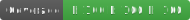

# BrilliantWallpaper 

[](https://github.com/dvd0bvb/BrilliantWallpaper/actions/workflows/cmake-multi-platform.yml) [](https://github.com/dvd0bvb/BrilliantWallpaper/actions/workflows/asan.yml) [](https://github.com/dvd0bvb/BrilliantWallpaper/actions/workflows/asan.yml) [](https://github.com/dvd0bvb/BrilliantWallpaper/actions/workflows/tsan.yml) 
[](https://github.com/dvd0bvb/BrilliantWallpaper/actions/workflows/clang-format-check.yml) [](https://github.com/dvd0bvb/BrilliantWallpaper/actions/workflows/clang-tidy-check.yml) [](https://github.com/dvd0bvb/BrilliantWallpaper/actions/workflows/cmake-format-check.yml)
[](https://dvd0bvb.github.io/BrilliantWallpaper) [](https://opensource.org/licenses/MIT) <a href="https://www.buymeacoffee.com/dvd0bvb"></a>

## Generate Your Wallpaper

BrilliantWallpaper allows you to create wallpapers, or desktop backgrounds, from a collection of images. It combines the images you configure into a single image and sets it as your wallpaper. It will then update the wallpaper at a configured interval. BrilliantWallpaper grabs random images until it cannot fit more images (scaled down if necessary) into the final image. Currently, only Windows 10 and 11 are supported.

An example wallpaper generated for a monitor with a resolution of 5120x1440:


## Make my Wallpapers

To get started with BrilliantWallpaper, download the latest release, right click on install.bat and run as adminiatrator. This will install BrilliantWallpaper in your "Program Files" folder. Next, navigate to "Program Files/BrilliantWallpaper" and edit config.toml. From the config.toml file, you can specify configuration for your monitors. A sample configuration is provided. 

For each configured monitor, a `[[monitors]]` entry must be added to config.toml. Each `[[monitors]]` entry must contain a `wallpapers` array containing complete paths to folders containing images or individual image files. You can optionally set a `transitionDelay` for each monitor. If no individual `transitionDelay` is configured, the global `transitionDelay` will be used.

```
transitionDelay = 30

[[monitors]]
wallpapers = [
	"C:/Users/me/Pictures/FirstMonitorFolder",
	"C:/Users/me/Downloads/my_cool_wallpaper.png"
]
transitionDelay = 20 # do this monitor every 20 minutes instead of 30

[[monitors]]
wallpapers = [
	"C:/Users/me/Pictures/SecondMonitorFolder"
]
```

Finally, run the BrilliantMonitors.exe to start generating wallpapers.

## I'll Make my Wallpapers: Building From Source

To build from source, clone the git repo to your machine. You will need to either have vcpkg installed or install the dependencies listed in vcpkg.json. Building then just requires using CMake. Enter the BrilliantWallpaper directory, create a directory named `build`, then run the following command, choosing Debug or Release:

```
cmake --build build --config {Debug/Release} --target BrilliantWallpaper
```

To build the tests:

```
cmake --build build --config Debug --target BrilliantWallpaper_TEST
```

## Notes and Next Steps

This repo was seeded from my [BrilliantCmake](https://github.com/dvd0bvb/BrilliantCMake) repo which includes github workflows that are targeted toward cross platform or Linux specific apps. This app only supports Windows at the time of writing so the generated workflows will be broken. The provided binaries have been tested on Windows 10 and 11.

Short term goals include
- Write unit tests and automate building and testing with github workflows.
- Get Asan builds working with Windows.

Longer term goals include
- Linux support - this is not something I've looked into at all yet. I have tried to sequester all Windows specific code to the Win subdirectory and support possible extension via the WallpaperSetter class.
- Tsan and possibly Msan builds.

## Supporting the project

If you have suggestions please feel free to open an issue or create a PR.

You can support me directly via Buy Me a Coffee [here](https://www.buymeacoffee.com/dvd0bvb).
